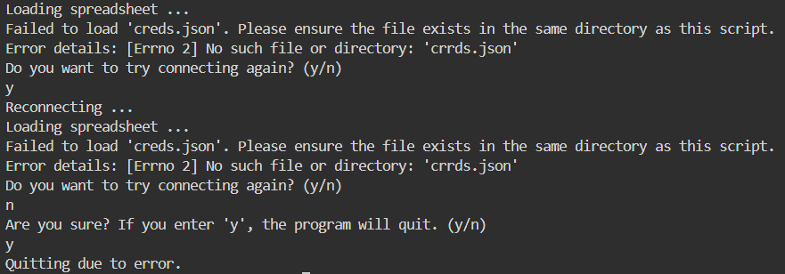
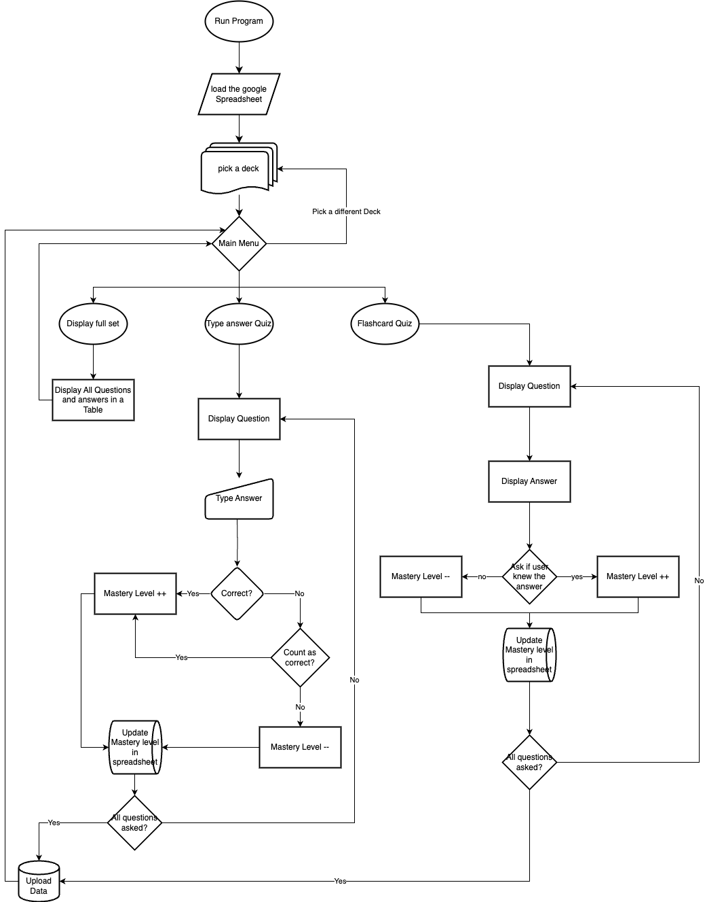

# [Flash-CLI](https://flash-cli-1471beedfcc0.herokuapp.com): Command-Line Vocabulary Training

[](https://github.com/benschaf/flash-cli/commits)
[](https://github.com/benschaf/flash-cli/commits/main)
[](https://github.com/benschaf/flash-cli/issues)
[](https://github.com/benschaf/flash-cli/issues?q=is%3Aissue+is%3Aclosed)
[](https://github.com/benschaf/flash-cli)
[](https://github.com/benschaf/flash-cli)
[](https://github.com/benschaf/flash-cli)
[](https://www.python.org/downloads/release/python-380/)
[](https://www.npmjs.com/package/npm)
[](https://www.docker.com/)
[](https://flash-cli-1471beedfcc0.herokuapp.com/)

Flash-CLI is a Python-based command-line flashcard application that seamlessly integrates with Google Sheets. Enhance your skills, compare your progress with everyone who used the app before, and master all kinds of flashcards — all from a Command Line Interface.

[Link to google Spreadsheet](https://docs.google.com/spreadsheets/d/1hGXKTWDj8vrl2kdby4OqQysjKpAUj-r4rwd_002I7Vc/edit?usp=sharing): This is the Google Spreadsheet that the app uses to store the flashcards.

[Link to live Website](https://flash-cli-1471beedfcc0.herokuapp.com/)

## UX

### Value for the Target Audience
Flash-CLI is designed for anyone who wants to expand their vocabulary and improve their language skills. The app is suitable for students, language learners, and professionals who want to learn new words and concepts efficiently.

The app is designed to be user-friendly and accessible to everyone, regardless of their technical background. It's a lightweight and fast tool that allows users to focus on learning without distractions.

Flash-CLI sets itself apart because it provides real-time feedback based on the user's performance and the community's performance. This feature motivates users and helps them put their progress into perspective.

### User Stories
| As a | I want to | so that I can |
| --- | --- | --- |
| User | review flashcards in the terminal | focus on learning without distractions |
| User | choose between multiple quiz modes | practice different quiz modes according to my preference and skill level |
| User | review a random flashcard and indicate if I knew the definition or not (in flashcard mode) | test my memory of the definition, get immediate feedback, and update the flashcard status |
| User | see a word and type the definition in typed answer mode | test my recall and understanding of the definition, get immediate feedback, and update the flashcard status |
| App provider | sync the flashcards with Google Sheets | easily create and edit flashcard decks online |
| User | receive real-time feedback based on my performance and the community's performance | monitor my progress and compare with others |
| Developer | handle errors gracefully and provide helpful messages | avoid frustration and confusion for users of the app |
| User | use keyboard shortcuts and efficient navigation in the terminal | improve my productivity and user experience |

### Why the Terminal?
The terminal is an ideal environment for vocabulary training for several reasons:

- **Focus on Learning:** By removing distractions (fancy UI elements, animations, etc.), the terminal allows users to concentrate solely on expanding their vocabulary.
- **Efficiency:** Terminal apps are lightweight and fast. Users can quickly launch the app, practice, and exit, thereby maximizing their time spent learning.
- **Keyboard-Centric Interaction:** Terminal apps encourage keyboard shortcuts and efficient navigation, which aligns well with learning and memorization.

_Note_: For this specific project, the terminal environment is emulated within a browser. However, the app is designed to be used in a traditional terminal environment.

## Features

### Main Menu and Navigation
The app provides a main menu with options to choose between different quiz modes and to exit the app. Users can navigate the app using keyboard shortcuts that are displayed in the menu. If the user wishes to have more information about the options, they can use the help (?) command.
All invalid inputs are handled gracefully, and the app provides helpful messages to guide users.


### Flashcard Mode: Users can review flashcards and decide if they know the answer.
Functionality:
- Display a random flashcard only with the word (question).
- Upon user input, reveal the definition (answer).
- Prompt the user to indicate if they knew the answer or not.
- Update the flashcard status based on the user's response.
- Provide personalized feedback based on the user's responses and the responses of the community so far.
This mode is designed to help users for initial learning and self-assessment. It's a simple and effective way to memorize new flashcards.


### Typed Answer Quizzes: Users type their answers directly.
Functionality:
- Display a word (question).
- Prompt the user to type the definition (answer).
- Check the user's input against the correct definition.
- If the user's input is incorrect, display the correct definition and ask the user if they want to count their attempt as a success or failure.
- Update the flashcard status based on the user's responses.
- Provide personalized feedback based on the user's responses and the responses of the community so far.
This mode is designed to test the user's recall and understanding of the flashcard. It's a more challenging and interactive way to practice and reinforce learning.


### Real-Time Google Sheets Sync
The app automatically syncs flashcard data with a connected Google Sheets document using the Google Sheets API. No user login is required.

The Google Sheet is set up so that every worksheet is a deck of flashcards. Each row represents a flashcard, with the word in the first column and the definition in the second column. Further columns are used to store the status of the flashcard.


### Real-Time Feedback:
The app will provide personalized and dynamically generated feedback based on collective performance. Feedback is given after answering most questions and at the end of each quiz. It's designed to motivate users and help put their progress into perspective.

Here are some examples of the feedback:
- "Great job! You're part of the 70% of people who knew the answer!"
- "You're doing better than 30% of people who attempted this flashcard."
- "You knew the answer! Great job!"
- "Don't worry, less than half of the people who attempted this flashcard knew the answer."
- "You're doing better than 40% of people who attempted this flashcard."
- "You wrote the correct answer! Great job!"
- "You're doing better than 20% of people who attempted this flashcard."
- "50% of people opted to treat the answer as correct or wrote it correctly. Keep practicing!"


### Error Handling and Logging
Flash-CLI gracefully handles unexpected errors and provides helpful messages to guide users. Additionally, the app logs application events for debugging and troubleshooting.

This is achieved using a custom built helper function:
```python
def handle_exception(e: Exception, message: str) -> NoReturn:
    """
    Handles an exception by printing an error message, logging the error,
    and exiting the program.

    Args:
        e (Exception): The exception that occurred.
        message (str): The error message to display.

    Returns:
        None
    """
    print(message)
    print(f"Error details: {e}")
    logging.exception(f"{message} Error details: %s", str(e))
    print("Quitting due to error.")
    sys.exit(1)
```
[View Code in project](https://github.com/benschaf/flash-cli/blob/04f1b1e25fe9bb4242dcb49575435691b4b7cfb1/run.py#L58-L74)

An example of how this function is called:
```python
try:
    # more code ...
    CREDS = Credentials.from_service_account_file("creds.json")
    # more code ...
except FileNotFoundError as e:
    handle_exception(e, "Failed to load 'creds.json'. Please ensure the file "
                     "exists in the same directory as this script.")
```
[Vew code in project](https://github.com/benschaf/flash-cli/blob/04f1b1e25fe9bb4242dcb49575435691b4b7cfb1/run.py#L77-L86)



### Gracefully handle unexpected errors (e.g., invalid input).
Invalid input: If the user enters an invalid command or input, the app will display a helpful message and prompt the user to try again.

Example:


## Future Features

- Quiz Modes
    - Multiple-Choice Quizzes: Randomized questions with answer choices.
    - Timed Quizzes: Set a time limit for answering questions.

- Flashcard Management
    - Create, edit, and delete flashcard decks.

- Statistics and Analytics
    - Display global progress (e.g., percentage of how many people knew an answer).
    - Show performance trends over time (graphs, charts).

- Use language APIs (e.g., WordNet, Google Translate) for:
    - Synonyms and antonyms
    - Example sentences
    - Word definitions
    - Pronunciations

- Gamification
    - Points and Badges: Reward users with points for completing quizzes or achieving milestones.

- Customizable Themes
    - Allow users to choose color schemes for the terminal interface (e.g., light mode, dark mode).
    - Use the rich library to create a more visually appealing interface.

- Backup and Restore
    - Regularly back up data (flashcards, progress) to prevent data loss.

### Tools

- [Google Sheets API](https://developers.google.com/sheets/api) as the database for flashcards.
- [Quizlet](https://quizlet.com/) for inspiration and comparison.
- [HTML](https://en.wikipedia.org/wiki/HTML) used to display a terminal in the browser.
- [Python](https://www.python.org) used as the back-end programming language (main focus of the project).
- [Git](https://git-scm.com) used for version control. (`git add`, `git commit`, `git push`)
- [GitHub](https://github.com) used for secure online code storage.
- [Gitpod](https://gitpod.io) used as a cloud-based IDE for development.
- [Heroku](https://www.heroku.com) used for hosting the deployed back-end site.
- [draw.io](https://www.drawio.com/) used for Flowchart creation
- [Windows Snipping Tool](https://support.microsoft.com/de-de/windows/aufnehmen-von-screenshots-mithilfe-des-snipping-tools-00246869-1843-655f-f220-97299b865f6b) used to take screenshots and screencasts on Windows
- [Github Issues](https://github.com/benschaf/tabletennis-vs-pingpong/issues) used for issue tracking
- [GitHub Projects](https://github.com/users/benschaf/projects/3) used for project management in conjunction with GitHub Issues
- [shields.io](https://shields.io/) used to create the badges in the README.md file
- [LICEcap](https://www.cockos.com/licecap/) used to create GIFs for the TESTING.md file

## Data Model

### Flowchart

To follow best practice, a flowchart was created for the app's logic,
and mapped out before coding began using a free version of [Draw.io](https://www.draw.io).

Below is the flowchart of the main process of this Python program. It shows the entire cycle of the program.

[Link to the Flowchart](https://drive.google.com/file/d/1rDfChnROSVD_QkKvOzWtL8e4Z6Wk0UX-/view?usp=sharing)



### Classes & Functions

The program uses two classes as a blueprint for the project's objects (OOP).

The `Flashcard` class represents a single flashcard, and the `Flashcard_Set` class represents a set (deck) of flashcards.

A number of `Flashcard` objects are stored in a `Flashcard_Set` object.

The objects are created using the data from the Google Sheets document. In the document, a worksheet represents a `Flahscard_Set` and each row represents a `Flashcard`.

```python
class Flashcard:
    """
    A class to represent a flashcard.

    Attributes:
        question (str): The question on the flashcard.
        answer (str): The answer to the question on the flashcard.
        progress_dict (dict): A dictionary to track the
        progress of the flashcard.

    Methods:
        show_question(): Prints the question on the flashcard.
        show_answer(): Prints the answer to the question on the flashcard.
        update_progress(progress_key: str): Updates the
        progress of the flashcard.

    """
    def __init__(self, question: str, answer: str, progress_dict: dict):
        self.question = question
        self.answer = answer
        self.progress_dict = progress_dict

    def show_question(self) -> None:
        # function code
    def show_answer(self) -> None:
        # function code
    def update_progress(self, progress_key: str) -> None:
        # function code
```

```python
class Flashcard_Set:
    """
    A class to represent a set of flashcards.

    Attributes:
        title (str): The title of the flashcard set.
        flashcards (List[Flashcard]): The flashcards in the set.

    Methods:
        _load_flashcards(): Loads the flashcards from the worksheet data.
        show_all(): Displays all the flashcards in a table format.
        upload() -> None: Prepares the flashcard data and uploads it to the
        Google Sheets worksheet.

        Note: The methods above all use helper methods to perform their tasks.
        These helper methods are not listed here.
    """
    def __init__(self, title: str):
        """
        Initializes a Flashcard_Set object.
        Uses the load_flashcards method to load the flashcards from the
        worksheet data.
        """
        self.title = title
        self.flashcards = self._load_flashcards()

    def _load_worksheet_data(self) -> List[Dict[str, Union[int, float, str]]]:
        # ...
    def _create_flashcard_from_row(
            self,
            row: Dict[str, Union[int, float, str]]
    ) -> Flashcard:
        # ...
    def _load_flashcards(self) -> List[Flashcard]:
        # ...
    def show_all(self) -> None:
        # ...
    def _convert_to_list_of_lists(self) -> list[list]:
        # ...
    def _prepare_data_for_upload(self) -> list:
        # ...
    def _upload_data_to_worksheet(self, data: list) -> None:
        # ...
    def upload(self) -> None:
        # ...
```

The primary functions outside of the classes used on this application are:
- `pick_set()`: Allows the user to choose a set of flashcards to practice.
- `give_feedback_card()` and `give_feedback_set()`: Provides personalized feedback based on the user's performance and the community's performance.
- `pick_mode()`: Allows the user to choose between different quiz modes and other actions. This function is the main menu of the app.
- `flashcard_mode()`: The flashcard mode allows the user to review flashcards and decide if they know the answer.
- `typed_answer_mode()`: The typed answer mode allows the user to type their answers directly.

### Imports

I've used the following Python packages and external imported packages.

- `import sys`: sys is used for system-specific parameters and functions.
- `import os`: os provides a way of using operating system dependent functionality.
- `import random`: random is used for generating random numbers.
- `import time`: time provides various time-related functions.
- `from typing import Dict, List, NoReturn, Tuple, Union`: These are used for type hinting in function signatures and variable declarations.
- `import gspread`: gspread is used for interacting with Google Spreadsheets.
- `from google.oauth2.service_account import Credentials`: Credentials is used for authenticating with the Google Sheets API.
- `import logging`: logging is used for logging errors, information, and warnings.
- `from prettytable import PrettyTable`: PrettyTable is used for creating ASCII art tables.

## Testing

For all testing, please refer to the [TESTING.md](TESTING.md) file.

## Deployment

Code Institute has provided a [template](https://github.com/Code-Institute-Org/python-essentials-template) to display the terminal view of this backend application in a modern web browser.
This is to improve the accessibility of the project to others.

The live deployed application can be found deployed on [Heroku](https://flash-cli-1471beedfcc0.herokuapp.com).

### Heroku Deployment

This project uses [Heroku](https://www.heroku.com), a platform as a service (PaaS) that enables developers to build, run, and operate applications entirely in the cloud.

Deployment steps are as follows, after account setup:

- Select **New** in the top-right corner of your Heroku Dashboard, and select **Create new app** from the dropdown menu.
- Your app name must be unique, and then choose a region closest to you (EU or USA), and finally, select **Create App**.
- From the new app **Settings**, click **Reveal Config Vars**, and set the value of KEY to `PORT`, and the value to `8000` then select *add*.
- If using any confidential credentials, such as CREDS.JSON, then these should be pasted in the Config Variables as well.
- Further down, to support dependencies, select **Add Buildpack**.
- The order of the buildpacks is important, select `Python` first, then `Node.js` second. (if they are not in this order, you can drag them to rearrange them)

Heroku needs two additional files in order to deploy properly.

- requirements.txt
- Procfile

You can install this project's **requirements** (where applicable) using:

- `pip3 install -r requirements.txt`

If you have your own packages that have been installed, then the requirements file needs updated using:

- `pip3 freeze --local > requirements.txt`

The **Procfile** can be created with the following command:

- `echo web: node index.js > Procfile`

For Heroku deployment, follow these steps to connect your own GitHub repository to the newly created app:

Either:

- Select **Automatic Deployment** from the Heroku app.

Or:

- In the Terminal/CLI, connect to Heroku using this command: `heroku login -i`
- Set the remote for Heroku: `heroku git:remote -a app_name` (replace *app_name* with your app name)
- After performing the standard Git `add`, `commit`, and `push` to GitHub, you can now type:
	- `git push heroku main`

The frontend terminal should now be connected and deployed to Heroku!

### Local Deployment

This project can be cloned or forked in order to make a local copy on your own system.

For either method, you will need to install any applicable packages found within the *requirements.txt* file.

- `pip3 install -r requirements.txt`.

If using any confidential credentials, such as `CREDS.json` or `env.py` data, these will need to be manually added to your own newly created project as well.

#### Cloning

You can clone the repository by following these steps:

1. Go to the [GitHub repository](https://github.com/benschaf/flash-cli)
2. Locate the Code button above the list of files and click it
3. Select if you prefer to clone using HTTPS, SSH, or GitHub CLI and click the copy button to copy the URL to your clipboard
4. Open Git Bash or Terminal
5. Change the current working directory to the one where you want the cloned directory
6. In your IDE Terminal, type the following command to clone my repository:
	- `git clone https://github.com/benschaf/flash-cli.git`
7. Press Enter to create your local clone.

Alternatively, if using Gitpod, you can click below to create your own workspace using this repository.

[](https://gitpod.io/#https://github.com/benschaf/flash-cli)

Please note that in order to directly open the project in Gitpod, you need to have the browser extension installed.
A tutorial on how to do that can be found [here](https://www.gitpod.io/docs/configure/user-settings/browser-extension).

#### Forking

By forking the GitHub Repository, we make a copy of the original repository on our GitHub account to view and/or make changes without affecting the original owner's repository.
You can fork this repository by using the following steps:

1. Log in to GitHub and locate the [GitHub Repository](https://github.com/benschaf/flash-cli)
2. At the top of the Repository (not top of page) just above the "Settings" Button on the menu, locate the "Fork" Button.
3. Once clicked, you should now have a copy of the original repository in your own GitHub account!

### Local VS Deployment

Since this project is a backend application, the local version is not significantly different from the live deployment on Heroku. The main difference is that the local version is run in a terminal environment, while the live deployment is emulated in a modern web browser.

The emulated CLI has some quirks and limitations compared to a traditional terminal environment. Some libraries tend to behave differently in the emulated environment, and the terminal view is limited to 80 columns by 24 rows. This means that each line of text needs to be 80 characters or less, otherwise it will be wrapped onto a second line. Additionally, the clear terminal function does not work as expected in the emulated environment.

All of these differences are taken into account during development, and the app is designed to work seamlessly in both environments.

## Credits

### Content
All the Credits and hyperlinks can be found in the [run.py](run.py) file on the indicated lines.

Note that this list of credits is automatically generated from the run.py file using the [copy-credits.py](copy-credits.py) script.
The script was written by me, with much help from the Microsoft Edge Copilot.

- Line: 11: [Credit for prettytable](https://pythonfusion.com/table-on-console-python/#37-terminaltables-or-asciitable)

- Line: 14: [Credit for error logging](https://medium.com/@saadjamilakhtar/5-best-practices-for-python-exception-handling-5e54b876a20)

- Line: 16: [Credit for formatting of log messages](https://docs.python.org/3/howto/logging.html)

- Line: 23: [Credit for clear Terminal function](https://stackoverflow.com/questions/2084508/clear-the-terminal-in-python)

- Line: 38: [Credit for using the google sheets API](https://github.com/Code-Institute-Solutions/love-sandwiches-p5-sourcecode)

- Line: 46: [Credit for exception handling](https://medium.com/@saadjamilakhtar/5-best-practices-for-python-exception-handling-5e54b876a20)

- Line: 49: [Credit for NoReturn type hint](https://adamj.eu/tech/2021/05/20/python-type-hints-whats-the-point-of-noreturn/)

- Line: 52: [Credit for parameter type hints](https://stackoverflow.com/questions/2489669/how-do-python-functions-handle-the-types-of-parameters-that-you-pass-in)

- Line: 104: [Credit for writing docstrings](https://www.datacamp.com/tutorial/docstrings-python?utm_source=google&utm_medium=paid_search&utm_campaignid=19589720818&utm_adgroupid=157156373751&utm_device=c&utm_keyword=&utm_matchtype=&utm_network=g&utm_adpostion=&utm_creative=684592138751&utm_targetid=dsa-2218886984100&utm_loc_interest_ms=&utm_loc_physical_ms=9115817&utm_content=&utm_campaign=230119_1-sea~dsa~tofu_2-b2c_3-eu_4-prc_5-na_6-na_7-le_8-pdsh-go_9-na_10-na_11-na&gad_source=1&gclid=CjwKCAiArLyuBhA7EiwA-qo80DbfmFCbaxqMhOuUbjm3RWcqe_zVQXPxO_LL6__tPOFhAhwsABLhxxoCPqwQAvD_BwE)

- Line: 344: [Credit for checking if input string is an int](https://www.w3schools.com/python/ref_func_isinstance.asp)

- Line: 554: [Credit for join method](https://docs.python.org/3/library/stdtypes.html#str.join)

- Line: 564: [Credit for case insensitive inputs](https://stackoverflow.com/questions/50192965/how-to-make-user-input-not-case-sensitive)

- Line: 619: [Credit for sleep function](https://www.datacamp.com/tutorial/python-time-sleep?utm_source=google&utm_medium=paid_search&utm_campaignid=19589720818&utm_adgroupid=157156373751&utm_device=c&utm_keyword=&utm_matchtype=&utm_network=g&utm_adpostion=&utm_creative=684592138751&utm_targetid=dsa-2218886984100&utm_loc_interest_ms=&utm_loc_physical_ms=9042759&utm_content=&utm_campaign=230119_1-sea~dsa~tofu_2-b2c_3-eu_4-prc_5-na_6-na_7-le_8-pdsh-go_9-na_10-na_11-na&gad_source=1&gclid=Cj0KCQiAoeGuBhCBARIsAGfKY7yufxE5zKBDYxMBH_VoxTSSnHmHTLuVcvkg8bWHAxgocfoWYEecr4oaAt8EEALw_wcB)

- Line: 747: [Credit to Tim Nelson (CI Mentor) for calling the main function like that.](https://medium.com/@mycodingmantras/what-does-if-name-main-mean-in-python-fa6b0460a62d#:~:text=The%20if%20__name__,set%20to%20__main__%20.)

- Line: 769: [Credit for line break](https://stackoverflow.com/questions/53162/how-can-i-do-a-line-break-line-continuation-in-python-split-up-a-long-line-of)

### Media
- French Flashcard Set: [CJHSalmeron on Quizlet](https://quizlet.com/744634653/french-adjectives-adjectives-in-french-flash-cards/)
- German Flashcard Set: [Rubir22 on Quizlet](https://quizlet.com/300188987/german-verbs-flash-cards/)
- Python Flashcard Set: [Tash207 on Quizlet](https://quizlet.com/493123451/python-flash-cards/)

## Acknowledgements
- I would like to thank my Code Institute mentor, [Tim Nelson](https://tim.2bn.dev/) for his support throughout the development of this project.
- I would like to thank the [Code Institute](https://codeinstitute.net/) tutor team for their assistance with troubleshooting and debugging some project issues.
- I would like to thank the Code Institute Slack community for the moral support; it kept me going during periods of self doubt and imposter syndrome.
- I would like to thank my wife Maria, for believing in me, and allowing me to make this transition into software development.