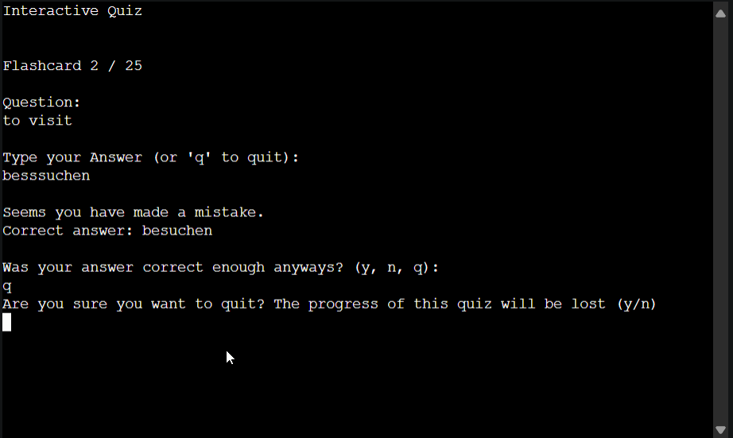

# Testing

Return back to the [README.md](README.md) file.

🛑🛑🛑🛑🛑 START OF NOTES (to be deleted) 🛑🛑🛑🛑🛑

In this section, you need to convince the assessors that you have conducted enough testing to legitimately believe that the site works well.
Essentially, in this part, you should go over all of your project's features, and ensure that they all work as intended,
with the project providing an easy and straightforward way for the users to achieve their goals.

🛑🛑🛑🛑🛑 END OF NOTES (to be deleted) 🛑🛑🛑🛑🛑

## Code Validation

🛑🛑🛑🛑🛑 START OF NOTES (to be deleted) 🛑🛑🛑🛑🛑

Use the space to discuss code validation for any of your own code files (where applicable).
You are not required to validate external libraries/frameworks, such as imported Bootstrap, Materialize, Font Awesome, etc.

**IMPORTANT**: You must provide a screenshot for each file you validate.

**PRO TIP**: Always validate the live site pages, not your local code. There could be subtle/hidden differences.

🛑🛑🛑🛑🛑 END OF NOTES (to be deleted) 🛑🛑🛑🛑🛑

### Python

🛑🛑🛑🛑🛑 START OF NOTES (to be deleted) 🛑🛑🛑🛑🛑

The CI Python Linter can be used two different ways.
- Copy/Paste your Python code directly into the linter.
- As an API, using the "raw" URL appended to the linter URL.
    - To find the "raw" URL, navigate to your file directly on the GitHub repo.
    - On that page, GitHub provides a button on the right called "Raw" that you can click on.
    - From that new page, copy the full URL, and paste it after the CI Python Linter URL (with a `/` separator).
    - Check the example table below for a live demo.

It's recommended to validate each file using the API URL.
This will give you a custom URL which you can use on your testing documentation.
It makes it easier to return back to a file to validate it again in the future.
Use the steps above to generate your own custom URLs for each Python file.

**IMPORTANT**: `E501 line too long` errors

You must strive to fix any Python lines that are too long ( >80 characters ).
In rare cases where you cannot break the lines [without breaking the functionality],
then by adding `# noqa` to the end of those lines will ignore linting validation.

`# noqa` = **NO Quality Assurance**

**NOTE**: You must include 2 *spaces* before the `#`, and 1 *space* after the `#`.

Do not use `# noqa` all over your project just to clear down validation errors!
This can still cause a project to fail, for failing to fix actual PEP8 validation errors.

Sometimes strings or variables get too long, or long `if` conditional statements.
These are acceptable instances to use the `# noqa`.

When trying to fix "line too long" errors, try to avoid using `/` to split lines.
A better approach would be to use any type of opening bracket, and hit Enter just after that.

Any opening bracket type will work: `(`, `[`, `{`.

By using an opening bracket, Python knows where to appropriately indent the next line of code,
without having to "guess" yourself and attempt to tab to the correct indentation level.

Sample Python code validation documentation below (tables are extremely helpful!).

**Note**: This gives examples of PP3 (Python-only), and Flask/Django files, so eliminate the ones not applicable to your own project.

🛑🛑🛑🛑🛑 END OF NOTES (to be deleted) 🛑🛑🛑🛑🛑

I have used the recommended [PEP8 CI Python Linter](https://pep8ci.herokuapp.com) to validate all of my Python files.

| File | CI URL | Screenshot | Notes |
| --- | --- | --- | --- |
| run.py | [PEP8 CI](https://pep8ci.herokuapp.com/https://raw.githubusercontent.com/benschaf/flash-cli/main/run.py) |  | All clear, no errors found |

Note: The [copy-credits.py](copy-credits.py) file was not validated, as it is a simple script used only for development and not part of the main project.

## Browser Compatibility

🛑🛑🛑🛑🛑 START OF NOTES (to be deleted) 🛑🛑🛑🛑🛑

Use this space to discuss testing the live/deployed site on various browsers.

Consider testing at least 3 different browsers, if available on your system.

Recommended browsers to consider:
- [Chrome](https://www.google.com/chrome)
- [Firefox (Developer Edition)](https://www.mozilla.org/firefox/developer)
- [Edge](https://www.microsoft.com/edge)
- [Safari](https://support.apple.com/downloads/safari)
- [Brave](https://brave.com/download)
- [Opera](https://www.opera.com/download)

**IMPORTANT**: You must provide screenshots of the tested browsers, to "prove" that you've actually tested them.

Please note, there are services out there that can test multiple browser compatibilities at the same time.
Some of these are paid services, but some are free.
If you use these, you must provide a link to the source used for attribution, and multiple screenshots of the results.

Sample browser testing documentation:

🛑🛑🛑🛑🛑 END OF NOTES (to be deleted) 🛑🛑🛑🛑🛑

I've tested my deployed project on multiple browsers to check for compatibility issues.

| Browser | Screenshot | Notes |
| --- | --- | --- |
| Chrome |  | Works as expected |
| Firefox |  | Works as expected |
| Edge |  | Works as expected |
| Opera |  | Works as expected |

## Responsiveness

🛑🛑🛑🛑🛑 START OF NOTES (to be deleted) 🛑🛑🛑🛑🛑

Use this space to discuss testing the live/deployed site on various device sizes.

The minimum requirement is for the following 3 tests:
- Mobile
- Tablet
- Desktop

**IMPORTANT**: You must provide screenshots of the tested responsiveness, to "prove" that you've actually tested them.

Using the "amiresponsive" mockup image (or similar) does not suffice the requirements.
Consider using some of the built-in device sizes in the Developer Tools.

If you have tested the project on your actual mobile phone or tablet, consider also including screenshots of these as well.
It showcases a higher level of manual tests, and can be seen as a positive inclusion!

Sample responsiveness testing documentation:

🛑🛑🛑🛑🛑 END OF NOTES (to be deleted) 🛑🛑🛑🛑🛑

I've tested my deployed project on multiple devices to check for responsiveness issues.

Note: since this is a CLI application, the responsiveness testing is limited. I have still tested on a mobile device and a tablet additionally to the desktop and included the results below.

| Device | Screenshot | Notes |
| --- | --- | --- |
| Google Pixel 6 |  | Terminal View is too large, inputting commands with the phone keyboard is awkward but it works |
| Desktop |  | Works as expected, Terminal will only take up top left space of the screen |
| Tablet (emulated) |  | Works as expected, same inputting issues that are present on mobile |

### Responsiveness within the CLI
The CLI application is not designed to be responsive in the traditional sense, as it is a terminal-based application.
However, lines longer than 80 characters are wrapped manually in the code to ensure that the application is still user friendly when lines are too long for the terminal.

The clear() function is used to clear the terminal screen often, to ensure that the user is not overwhelmed with too much information at once. No scrolling is required, as the terminal is cleared and reprinted with the new information. The information displayed should almost never exceed the height of the terminal.

The exception to the scrolling rule is when the user is reviewing a long deck of flashcards. If the deck is too long, the user will still have to scroll. This is a necessary exception, as the user should be able to review all of their flashcards at once.

## Lighthouse Audit

🛑🛑🛑🛑🛑 START OF NOTES (to be deleted) 🛑🛑🛑🛑🛑

Use this space to discuss testing the live/deployed site's Lighthouse Audit reports.
Avoid testing the local version (especially if developing in Gitpod), as this can have knock-on effects of performance.

If you don't have Lighthouse in your Developer Tools,
it can be added as an [extension](https://chrome.google.com/webstore/detail/lighthouse/blipmdconlkpinefehnmjammfjpmpbjk).

Don't just test the home page (unless it's a single-page application).
Make sure to test the Lighthouse Audit results for all of your pages.

**IMPORTANT**: You must provide screenshots of the results, to "prove" that you've actually tested them.

Sample Lighthouse testing documentation:

🛑🛑🛑🛑🛑 END OF NOTES (to be deleted) 🛑🛑🛑🛑🛑

I've tested my deployed project using the Lighthouse Audit tool to check for any major issues.

| Device | Screenshot | Notes |
| --- | --- | --- |
| Mobile |  | Some minor warnings |
| Desktop |  | Some minor warnings |

The most prominent takeaway from the Lighthouse Audit is that the pageload of the application is affected visibly because the application attempts a download from the Google Sheets API. This is a necessary part of the application, and the user is informed of this while the application is loading.

## Defensive Programming Testing

🛑🛑🛑🛑🛑 START OF NOTES (to be deleted) 🛑🛑🛑🛑🛑

Defensive programming (defensive design) is extremely important!

When building projects that accept user inputs or forms, you should always test the level of security for each.
Examples of this could include (not limited to):

Forms:
- Users cannot submit an empty form
- Users must enter valid email addresses

PP3 (Python-only):
- Users must enter a valid letter/word/string when prompted
- Users must choose from a specific list only

MS3 (Flask) | MS4/PP4/PP5 (Django):
- Users cannot brute-force a URL to navigate to a restricted page
- Users cannot perform CRUD functionality while logged-out
- User-A should not be able to manipulate data belonging to User-B, or vice versa
- Non-Authenticated users should not be able to access pages that require authentication
- Standard users should not be able to access pages intended for superusers

You'll want to test all functionality on your application, whether it's a standard form,
or uses CRUD functionality for data manipulation on a database.
Make sure to include the `required` attribute on any form-fields that should be mandatory.
Try to access various pages on your site as different user types (User-A, User-B, guest user, admin, superuser).

You should include any manual tests performed, and the expected results/outcome.

Testing should be replicable.
Ideally, tests cases should focus on each individual section of every page on the website.
Each test case should be specific, objective, and step-wise replicable.

Instead of adding a general overview saying that everything works fine,
consider documenting tests on each element of the page
(ie. button clicks, input box validation, navigation links, etc.) by testing them in their happy flow,
and also the bad/exception flow, mentioning the expected and observed results,
and drawing a parallel between them where applicable.

Consider using the following format for manual test cases:

Expected Outcome / Test Performed / Result Received / Fixes Implemented

- **Expected**: "Feature is expected to do X when the user does Y."
- **Testing**: "Tested the feature by doing Y."
- (either) **Result**: "The feature behaved as expected, and it did Y."
- (or) **Result**: "The feature did not respond to A, B, or C."
- **Fix**: "I did Z to the code because something was missing."

Use the table below as a basic start, and expand on it using the logic above.

🛑🛑🛑🛑🛑 END OF NOTES (to be deleted) 🛑🛑🛑🛑🛑

Defensive programming was manually tested with the below user acceptance testing:

| Checkpoint in Application Flow | Expectation | Test | Result | Fix | Screenshot |
| --- | --- | --- | --- | --- | --- |
| On Application load | A Flashcard Set is expected to be loaded when the user inputs an applicable Number | Tested the feature by inputting Numbers between 1 and 4 | The feature behaved as expected, and loaded each | Test concluded and passed | 
| On Application load | A Flashcard Set is expected to be loaded when the user inputs an applicable String | Tested the feature by inputting Strings | The feature behaved as expected, and loaded each Set | Test concluded and passed |  |
| On Application load | When any other input is given, the user is expected to be prompted to input a valid Number or String | Tested the feature by inputting invalid inputs including out of bound numbers, letters, and symbols | The feature behaved as expected, and prompted the user to input a valid Number or String | Test concluded and passed |  |
| Main Menu | The user is expected to be able to navigate to any of the options in the Main Menu by inputting the applicable letter (case-insensitive) | Tested the feature by inputting the applicable letters | The feature behaved as expected, and navigated to the applicable option | Test concluded and passed |  |
| Main Menu | When any other input is given, the user is expected to be prompted to input a valid letter or to go back to the Main Menu | Tested the feature by inputting invalid inputs including numbers, letters, and symbols and going back to the Main Menu | The feature behaved as expected, and prompted the user to input a valid letter - when 'b' is given as an input the Main Menu is shown again | Test concluded and passed |  |
| Study with Flashcards | The user is expected to be able to reveal the answer to a displayed question by pressing ENTER | Tested the feature by pressing ENTER | The feature behaved as expected, and revealed the answer | Test concluded and passed |  |
| Study with Flashcards | The user is expected to be able to go back to the Main Menu by inputting 'q' after being asked if they are sure to go back | Tested the feature by inputting 'q' | The feature behaved as expected, and went back to the Main Menu after confirming | Test concluded and passed |  |
| Study with Flashcards | When any other input besides from 'q' is given, the input should be ignored and the answer should be shown. | Tested the feature by inputting invalid inputs including numbers, letters, and symbols | The feature behaved as expected, and ignored the input and showed the answer | Test concluded and passed |  |
| Study with Flashcards | After revealing the answer, the user is expected to be able to only input 'y' or 'n' to continue or 'q' to go back to the Main Menu | Tested the feature by inputting 'y', 'n', and 'q' | The feature behaved as expected, and continued, stopped, or went back to the Main Menu | Test concluded and passed |  |
| Study with Flashcards | When any other input besides from 'y', 'n', or 'q' is given, the input should be ignored and the user should be prompted to input a valid letter | Tested the feature by inputting invalid inputs including numbers, letters, and symbols | The feature behaved as expected, and ignored the input and prompted the user to input a valid letter | Test concluded and passed |  |
| Study with Flashcards | Once the user has gone through all the flashcards, the user is expected to be prompted to go back to the Main Menu by pressing ENTER | Tested the feature by pressing ENTER | The feature behaved as expected, and went back to the Main Menu | Test concluded and passed |  |
| Study with Flashcards | When any other input besides from ENTER is given, the input should be ignored and the user should be sent back to the Main Menu | Tested the feature by inputting invalid inputs including numbers, letters, and symbols | The feature behaved as expected, and ignored the input and went back to the Main Menu | Test concluded and passed |  |
| Interactive Quiz | The user is expected to be able to answer the question by inputting the correct answer as a string | Tested the feature by inputting the correct answer | The feature behaved as expected, and accepted the correct answer | Test concluded and passed |  |
| Interactive Quiz | If any other input besides the correct answer is given, the answer should be counted as incorrect | Tested the feature by inputting incorrect answers | The feature behaved as expected, and counted the answer as incorrect | Test concluded and passed |  |
| Interactive Quiz | The user is expected to be able to go back to the Main Menu by inputting 'q' after being asked if they are sure to go back | Tested the feature by inputting 'q' | The feature behaved as expected, and went back to the Main Menu after confirming | Test concluded and passed |  |
| Interactive Quiz | After an answer was counted as incorrect, the user should have the option to either treat the answer as correct or incorrect by inputting 'y' or 'n' | Tested the feature by inputting 'y' and 'n' | The feature behaved as expected, and treated the answer as correct or incorrect | Test concluded and passed |  |
| Interactive Quiz | When any other input besides from 'y', 'n', or 'q' is given, the input should be ignored and the user should be prompted to input a valid letter | Tested the feature by inputting invalid inputs including numbers, letters, and symbols | The feature behaved as expected, and ignored the input and prompted the user to input a valid letter | Test concluded and passed |  |
| Interactive Quiz | Once the user has gone through all the questions, the user is expected to be prompted to go back to the Main Menu by pressing ENTER | Tested the feature by pressing ENTER | The feature behaved as expected, and went back to the Main Menu | Test concluded and passed |  |
| Interactive Quiz | When any other input besides from ENTER is given, the input should be ignored and the user should be sent back to the Main Menu | Tested the feature by inputting invalid inputs including numbers, letters, and symbols | The feature behaved as expected, and ignored the input and went back to the Main Menu | Test concluded and passed |  |
| Review All Flashcards | The user is expected to be able to review all flashcards by scrolling up and down | Tested the feature by scrolling up and down | The feature behaved as expected, and allowed the user to review all flashcards. Note that because of the clear() function bug, the user will sometimes see old content at the top of the terminal | Test concluded, the clear() function bug is known and acceptable |  |
| Review All Flashcards | The user is expected to be able to go back to the Main Menu by inputting ENTER, any other input should be ignored | Tested the feature by inputting ENTER and other inputs | The feature behaved as expected, and went back to the Main Menu or ignored the input | Test concluded and passed |  |
| Need more details? Just type '?' | The user is expected to be able to either pick one of the menu options or go back to the Main Menu by inputting 'b' | Tested the feature by inputting all menu options and 'b' | The feature behaved as expected, and navigated to the applicable option or went back to the Main Menu | Test concluded and passed |  |
| Need more details? Just type '?' | When any other input besides from the menu options or 'b' is given, the user should be prompted to input a valid letter | Tested the feature by inputting invalid inputs including numbers, letters, and symbols | The feature behaved as expected, and prompted the user to input a valid letter | Test concluded and passed |  |

## User Story Testing

🛑🛑🛑🛑🛑 START OF NOTES (to be deleted) 🛑🛑🛑🛑🛑

Testing user stories is actually quite simple, once you've already got the stories defined on your README.

Most of your project's **features** should already align with the **user stories**,
so this should as simple as creating a table with the user story, matching with the re-used screenshot
from the respective feature.

🛑🛑🛑🛑🛑 END OF NOTES (to be deleted) 🛑🛑🛑🛑🛑

| User Story | Screenshot |
| --- | --- |
| As a new site user, I would like to ____________, so that I can ____________. |  |
| As a new site user, I would like to ____________, so that I can ____________. |  |
| As a new site user, I would like to ____________, so that I can ____________. |  |
| As a returning site user, I would like to ____________, so that I can ____________. |  |
| As a returning site user, I would like to ____________, so that I can ____________. |  |
| As a returning site user, I would like to ____________, so that I can ____________. |  |
| As a site administrator, I should be able to ____________, so that I can ____________. |  |
| As a site administrator, I should be able to ____________, so that I can ____________. |  |
| As a site administrator, I should be able to ____________, so that I can ____________. |  |
| repeat for all remaining user stories | x |

## Bugs

🛑🛑🛑🛑🛑 START OF NOTES (to be deleted) 🛑🛑🛑🛑🛑

This section is primarily used for JavaScript and Python applications,
but feel free to use this section to document any HTML/CSS bugs you might run into.

It's very important to document any bugs you've discovered while developing the project.
Make sure to include any necessary steps you've implemented to fix the bug(s) as well.

**PRO TIP**: screenshots of bugs are extremely helpful, and go a long way!

🛑🛑🛑🛑🛑 END OF NOTES (to be deleted) 🛑🛑🛑🛑🛑

- JS Uncaught ReferenceError: `foobar` is undefined/not defined

    

    - To fix this, I _____________________.

- JS `'let'` or `'const'` or `'template literal syntax'` or `'arrow function syntax (=>)'` is available in ES6 (use `'esversion: 11'`) or Mozilla JS extensions (use moz).

    

    - To fix this, I _____________________.

- Python `'ModuleNotFoundError'` when trying to import module from imported package

    

    - To fix this, I _____________________.

- Django `TemplateDoesNotExist` at /appname/path appname/template_name.html

    

    - To fix this, I _____________________.

- Python `E501 line too long` (93 > 79 characters)

    

    - To fix this, I _____________________.

## Unfixed Bugs

🛑🛑🛑🛑🛑 START OF NOTES (to be deleted) 🛑🛑🛑🛑🛑

You will need to mention unfixed bugs and why they were not fixed.
This section should include shortcomings of the frameworks or technologies used.
Although time can be a big variable to consider, paucity of time and difficulty understanding
implementation is not a valid reason to leave bugs unfixed.

If you've identified any unfixed bugs, no matter how small, be sure to list them here.
It's better to be honest and list them, because if it's not documented and an assessor finds the issue,
they need to know whether or not you're aware of them as well, and why you've not corrected/fixed them.

Some examples:

🛑🛑🛑🛑🛑 END OF NOTES (to be deleted) 🛑🛑🛑🛑🛑

- On devices smaller than 375px, the page starts to have `overflow-x` scrolling.

    

    - Attempted fix: I tried to add additional media queries to handle this, but things started becoming too small to read.

- For PP3, when using a helper `clear()` function, any text above the height of the terminal does not clear, and remains when you scroll up.

    

    - Attempted fix: I tried to adjust the terminal size, but it only resizes the actual terminal, not the allowable area for text.

- When validating HTML with a semantic `section` element, the validator warns about lacking a header `h2-h6`. This is acceptable.

    

    - Attempted fix: this is a known warning and acceptable, and my section doesn't require a header since it's dynamically added via JS.

🛑🛑🛑🛑🛑 START OF NOTES (to be deleted) 🛑🛑🛑🛑🛑

If you legitimately cannot find any unfixed bugs or warnings, then use the following sentence:

🛑🛑🛑🛑🛑 END OF NOTES (to be deleted) 🛑🛑🛑🛑🛑

There are no remaining bugs that I am aware of.
