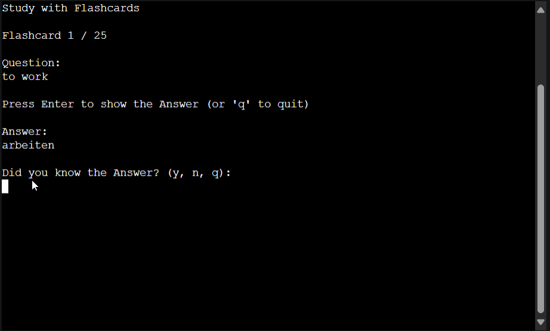

# Testing

Return back to the [README.md](README.md) file.

## Code Validation

### Python

I have used the recommended [PEP8 CI Python Linter](https://pep8ci.herokuapp.com) to validate all of my Python files.

| File | CI URL | Screenshot | Notes |
| --- | --- | --- | --- |
| run.py | [PEP8 CI](https://pep8ci.herokuapp.com/https://raw.githubusercontent.com/benschaf/flash-cli/main/run.py) |  | All clear, no errors found |

Note: The [copy-credits.py](copy-credits.py) file was not validated, as it is a simple script used only for development and not part of the main project.

## Browser Compatibility

I've tested my deployed project on multiple browsers to check for compatibility issues.

| Browser | Screenshot | Notes |
| --- | --- | --- |
| Chrome |  | Works as expected |
| Firefox |  | Works as expected |
| Edge |  | Works as expected |
| Opera |  | Works as expected |

## Responsiveness

I've tested my deployed project on multiple devices to check for responsiveness issues.

Note: since this is a CLI application, the responsiveness testing is limited. I have still tested on a mobile device and a tablet additionally to the desktop and included the results below.

| Device | Screenshot | Notes |
| --- | --- | --- |
| Google Pixel 6 |  | Terminal View is too large, inputting commands with the phone keyboard is awkward but it works |
| Desktop |  | Works as expected, Terminal will only take up top left space of the screen |
| Tablet (emulated) |  | Works as expected, same inputting issues that are present on mobile |

### Responsiveness within the CLI
The CLI application is not designed to be responsive in the traditional sense, as it is a terminal-based application.
However, lines longer than 80 characters are wrapped manually in the code to ensure that the application is still user friendly when lines are too long for the terminal.

The clear() function is used to clear the terminal screen often, to ensure that the user is not overwhelmed with too much information at once. No scrolling is required, as the terminal is cleared and reprinted with the new information. The information displayed should almost never exceed the height of the terminal.

The exception to the scrolling rule is when the user is reviewing a long deck of flashcards. If the deck is too long, the user will still have to scroll. This is a necessary exception, as the user should be able to review all of their flashcards at once.

## Lighthouse Audit

I've tested my deployed project using the Lighthouse Audit tool to check for any major issues.

| Device | Screenshot | Notes |
| --- | --- | --- |
| Mobile |  | Some minor warnings |
| Desktop |  | Some minor warnings |

The most prominent takeaway from the Lighthouse Audit is that the pageload of the application is affected visibly because the application attempts a download from the Google Sheets API. This is a necessary part of the application, and the user is informed of this while the application is loading.

## Defensive Programming Testing

Defensive programming was manually tested with the below user acceptance testing:

| Checkpoint in Application Flow | Expectation | Test | Result | Fix | Screenshot |
| --- | --- | --- | --- | --- | --- |
| On Application load | A Flashcard Set is expected to be loaded when the user inputs an applicable Number | Tested the feature by inputting Numbers between 1 and 4 | The feature behaved as expected, and loaded each | Test concluded and passed | 
| On Application load | A Flashcard Set is expected to be loaded when the user inputs an applicable String | Tested the feature by inputting Strings | The feature behaved as expected, and loaded each Set | Test concluded and passed |  |
| On Application load | When any other input is given, the user is expected to be prompted to input a valid Number or String | Tested the feature by inputting invalid inputs including out of bound numbers, letters, and symbols | The feature behaved as expected, and prompted the user to input a valid Number or String | Test concluded and passed |  |
| Main Menu | The user is expected to be able to navigate to any of the options in the Main Menu by inputting the applicable letter (case-insensitive) | Tested the feature by inputting the applicable letters | The feature behaved as expected, and navigated to the applicable option | Test concluded and passed |  |
| Main Menu | When any other input is given, the user is expected to be prompted to input a valid letter or to go back to the Main Menu | Tested the feature by inputting invalid inputs including numbers, letters, and symbols and going back to the Main Menu | The feature behaved as expected, and prompted the user to input a valid letter - when 'b' is given as an input the Main Menu is shown again | Test concluded and passed |  |
| Study with Flashcards | The user is expected to be able to reveal the answer to a displayed question by pressing ENTER | Tested the feature by pressing ENTER | The feature behaved as expected, and revealed the answer | Test concluded and passed |  |
| Study with Flashcards | The user is expected to be able to go back to the Main Menu by inputting 'q' after being asked if they are sure to go back | Tested the feature by inputting 'q' | The feature behaved as expected, and went back to the Main Menu after confirming | Test concluded and passed |  |
| Study with Flashcards | When any other input besides from 'q' is given, the input should be ignored and the answer should be shown. | Tested the feature by inputting invalid inputs including numbers, letters, and symbols | The feature behaved as expected, and ignored the input and showed the answer | Test concluded and passed |  |
| Study with Flashcards | After revealing the answer, the user is expected to be able to only input 'y' or 'n' to continue or 'q' to go back to the Main Menu | Tested the feature by inputting 'y', 'n', and 'q' | The feature behaved as expected, and continued, stopped, or went back to the Main Menu | Test concluded and passed |  |
| Study with Flashcards | When any other input besides from 'y', 'n', or 'q' is given, the input should be ignored and the user should be prompted to input a valid letter | Tested the feature by inputting invalid inputs including numbers, letters, and symbols | The feature behaved as expected, and ignored the input and prompted the user to input a valid letter | Test concluded and passed |  |
| Study with Flashcards | Once the user has gone through all the flashcards, the user is expected to be prompted to go back to the Main Menu by pressing ENTER | Tested the feature by pressing ENTER | The feature behaved as expected, and went back to the Main Menu | Test concluded and passed |  |
| Study with Flashcards | When any other input besides from ENTER is given, the input should be ignored and the user should be sent back to the Main Menu | Tested the feature by inputting invalid inputs including numbers, letters, and symbols | The feature behaved as expected, and ignored the input and went back to the Main Menu | Test concluded and passed |  |
| Interactive Quiz | The user is expected to be able to answer the question by inputting the correct answer as a string | Tested the feature by inputting the correct answer | The feature behaved as expected, and accepted the correct answer | Test concluded and passed |  |
| Interactive Quiz | If any other input besides the correct answer is given, the answer should be counted as incorrect | Tested the feature by inputting incorrect answers | The feature behaved as expected, and counted the answer as incorrect | Test concluded and passed |  |
| Interactive Quiz | The user is expected to be able to go back to the Main Menu by inputting 'q' after being asked if they are sure to go back | Tested the feature by inputting 'q' | The feature behaved as expected, and went back to the Main Menu after confirming | Test concluded and passed |  |
| Interactive Quiz | After an answer was counted as incorrect, the user should have the option to either treat the answer as correct or incorrect by inputting 'y' or 'n' | Tested the feature by inputting 'y' and 'n' | The feature behaved as expected, and treated the answer as correct or incorrect | Test concluded and passed |  |
| Interactive Quiz | When any other input besides from 'y', 'n', or 'q' is given, the input should be ignored and the user should be prompted to input a valid letter | Tested the feature by inputting invalid inputs including numbers, letters, and symbols | The feature behaved as expected, and ignored the input and prompted the user to input a valid letter | Test concluded and passed |  |
| Interactive Quiz | Once the user has gone through all the questions, the user is expected to be prompted to go back to the Main Menu by pressing ENTER | Tested the feature by pressing ENTER | The feature behaved as expected, and went back to the Main Menu | Test concluded and passed |  |
| Interactive Quiz | When any other input besides from ENTER is given, the input should be ignored and the user should be sent back to the Main Menu | Tested the feature by inputting invalid inputs including numbers, letters, and symbols | The feature behaved as expected, and ignored the input and went back to the Main Menu | Test concluded and passed |  |
| Review All Flashcards | The user is expected to be able to review all flashcards by scrolling up and down | Tested the feature by scrolling up and down | The feature behaved as expected, and allowed the user to review all flashcards. Note that because of the clear() function bug, the user will sometimes see old content at the top of the terminal | Test concluded, the clear() function bug is known and acceptable |  |
| Review All Flashcards | The user is expected to be able to go back to the Main Menu by inputting ENTER, any other input should be ignored | Tested the feature by inputting ENTER and other inputs | The feature behaved as expected, and went back to the Main Menu or ignored the input | Test concluded and passed |  |
| Need more details? Just type '?' | The user is expected to be able to either pick one of the menu options or go back to the Main Menu by inputting 'b' | Tested the feature by inputting all menu options and 'b' | The feature behaved as expected, and navigated to the applicable option or went back to the Main Menu | Test concluded and passed |  |
| Need more details? Just type '?' | When any other input besides from the menu options or 'b' is given, the user should be prompted to input a valid letter | Tested the feature by inputting invalid inputs including numbers, letters, and symbols | The feature behaved as expected, and prompted the user to input a valid letter | Test concluded and passed |  |

## User Story Testing

| User Story | Feature | Screenshot |
| --- | --- | --- |
| As a User, I want to review flashcards in the terminal, so that I can focus on learning without distractions. | Study with Flashcards |  |
| As a User, I want to choose between multiple quiz modes, so that I can practice different quiz modes according to my preference and skill level. | Main Menu |  |
| As a User, I want to review a random flashcard and indicate if I knew the definition or not (in flashcard mode), so that I can test my memory of the definition, get immediate feedback, and update the flashcard status. | Study with Flashcards |  |
| As a User, I want to see a word and type the definition in typed answer mode, so that I can test my recall and understanding of the definition, get immediate feedback, and update the flashcard status. | Interactive Quiz |  |
| As an App provider, I want to sync the flashcards with Google Sheets, so that I can easily create and edit flashcard decks online. | Real Time Sync |  |
| As a User, I want to receive real-time feedback based on my performance and the community's performance, so that I can monitor my progress and compare with others. | Real Time Feedback |  |
| As a Developer, I want to handle errors gracefully and provide helpful messages, so that I can avoid frustration and confusion for users of the app. | Error Handling and Logging |  |
| As a User, I want to use keyboard shortcuts and efficient navigation in the terminal, so that I can improve my productivity and user experience. | Whole Application |  |

## Bugs

🛑🛑🛑🛑🛑 START OF NOTES (to be deleted) 🛑🛑🛑🛑🛑

This section is primarily used for JavaScript and Python applications,
but feel free to use this section to document any HTML/CSS bugs you might run into.

It's very important to document any bugs you've discovered while developing the project.
Make sure to include any necessary steps you've implemented to fix the bug(s) as well.

**PRO TIP**: screenshots of bugs are extremely helpful, and go a long way!

🛑🛑🛑🛑🛑 END OF NOTES (to be deleted) 🛑🛑🛑🛑🛑

- JS Uncaught ReferenceError: `foobar` is undefined/not defined

    

    - To fix this, I _____________________.

- JS `'let'` or `'const'` or `'template literal syntax'` or `'arrow function syntax (=>)'` is available in ES6 (use `'esversion: 11'`) or Mozilla JS extensions (use moz).

    

    - To fix this, I _____________________.

- Python `'ModuleNotFoundError'` when trying to import module from imported package

    

    - To fix this, I _____________________.

- Django `TemplateDoesNotExist` at /appname/path appname/template_name.html

    

    - To fix this, I _____________________.

- Python `E501 line too long` (93 > 79 characters)

    

    - To fix this, I _____________________.

## Unfixed Bugs

🛑🛑🛑🛑🛑 START OF NOTES (to be deleted) 🛑🛑🛑🛑🛑

You will need to mention unfixed bugs and why they were not fixed.
This section should include shortcomings of the frameworks or technologies used.
Although time can be a big variable to consider, paucity of time and difficulty understanding
implementation is not a valid reason to leave bugs unfixed.

If you've identified any unfixed bugs, no matter how small, be sure to list them here.
It's better to be honest and list them, because if it's not documented and an assessor finds the issue,
they need to know whether or not you're aware of them as well, and why you've not corrected/fixed them.

Some examples:

🛑🛑🛑🛑🛑 END OF NOTES (to be deleted) 🛑🛑🛑🛑🛑

- On devices smaller than 375px, the page starts to have `overflow-x` scrolling.

    

    - Attempted fix: I tried to add additional media queries to handle this, but things started becoming too small to read.

- For PP3, when using a helper `clear()` function, any text above the height of the terminal does not clear, and remains when you scroll up.

    

    - Attempted fix: I tried to adjust the terminal size, but it only resizes the actual terminal, not the allowable area for text.

- When validating HTML with a semantic `section` element, the validator warns about lacking a header `h2-h6`. This is acceptable.

    

    - Attempted fix: this is a known warning and acceptable, and my section doesn't require a header since it's dynamically added via JS.

🛑🛑🛑🛑🛑 START OF NOTES (to be deleted) 🛑🛑🛑🛑🛑

If you legitimately cannot find any unfixed bugs or warnings, then use the following sentence:

🛑🛑🛑🛑🛑 END OF NOTES (to be deleted) 🛑🛑🛑🛑🛑

There are no remaining bugs that I am aware of.
